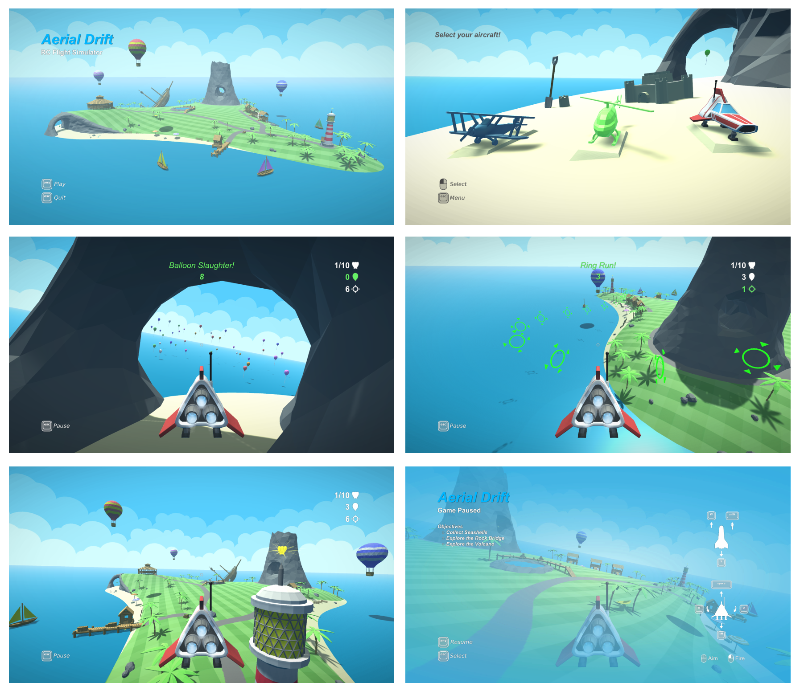

# Aerial Drift
&nbsp; A relaxing RC flight simulator built in Unity for UMSL's Game Dev course. &nbsp;

#### Features
&nbsp;&nbsp;&nbsp;&nbsp;&nbsp; Three vehicles with unique flight models

&nbsp;&nbsp;&nbsp;&nbsp;&nbsp; Three distinct dame modes

&nbsp;&nbsp;&nbsp;&nbsp;&nbsp; One huge island to explore

#### Screenshots

#### Download
- Demo build 
